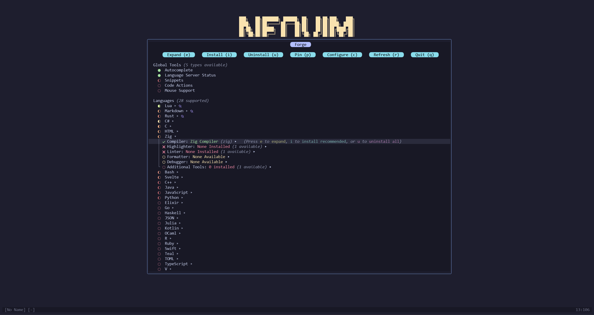

<center>

`Forge.nvim` provides a UI interface organizing and collecting several essential plugins including `mason.nvim`, `nvim-treesitter`, and many more, as well as managing compiler and interpreter installations. 

</center>

## Demo



<span style="color: red">**Warning: Forge.nvim is still in a pre-alpha state and does not have all of the listed functionality.**</span>


## Example Installation & Configuration

- With `lazy.nvim`:
```lua
{
    "neph-iap/forge.nvim",
    dependencies = { "nvim-treesitter/nvim-treesitter", "williamboman/mason.nvim" },
    opts = {},
    keys = { { "<leader>fr", "<cmd>Forge<cr>", desc = "Forge" } }
}
```

## What is `Forge.nvim`?

`Forge.nvim` comes with 2 UI floating window with a list of over 20 programming languages. Each language can have its compiler, syntax highlighter, linter, and formatter installed through the UI with no commands or manual downloads necessary. When multiple options are available (e.g. `gcc` vs `clang` vs `zig`), the user can pick a specific one, or install the recommended automatically.

Syntax highlighters are mostly installed through `nvim-treesitter`, and linters (LSPs) are mostly installed through `mason.nvim`, which is why they are both dependencies to the plugin.

## Why `Forge.nvim`?

A common question might be what the purpose of making `forge.nvim` is when tools like `mason.nvim` and `nvim-treesitter` already exist. The reality is, learning to program is overwhelming, especially in Neovim; The amount of tools available is huge and understanding how to set up and use these tools can take a long time. The purpose of `forge.nvim` is to streamline the devtools installation and setup process. 

Want to write C, but you've never installed anything before? Press one button, and all the power of the language is at your fingertips: The compiler, LSP, semantic highlighter, auto-formatter, debugger, and additional support plugins can all be installed with a single button press. 

`Forge.nvim` also aims to eliminate the "what's the name of the tool?" process, such as scrolling up and down `mason.nvim` looking for a Python debugger, when searching "Python" and checking under "P" doesn't seem to be helpful. Often, you'd have to search the web to discover that it's called `debugpy`. In some cases of poorly-named tools, this process is repeated for every tool of the language: the LSP, the formatter, the debugger, etc. `Forge.nvim` aims to wash away that headache by providing easy tool installation *under the name of the language*. 

Your homework for your new class requires you to write Rust but you've never done it before, and you just want to get the homework done without looking up and finding a bunch of installs? Pop open `forge.nvim`, scroll down to Rust, and press `i`, and in the blink of an eye you're set up with the LSP, the compiler, the package manager, the highlighter, the formatter, and more.

In general, `forge.nvim` does not aim to provide any new or groundbreaking functionality to Neovim; Instead, it aims simply to streamline the complex process of installing developer tools. Much of this is already possible and even simple using just `mason.nvim` and `nvim-treesitter`, but `forge.nvim` aims to be so dead simple that even a five year old could figure it out without looking anything up.

## Issues

`Forge.nvim` is still in a pre-alpha state, and much of the promised functionality is not yet implemented. As such, many issues, bugs, and lacking features are known. However, feel free to make an issue regardless, and progress on that feature/bug can be tracked there.
